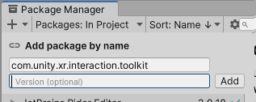
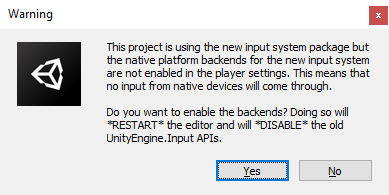
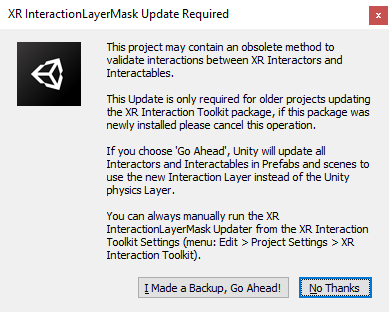

# Installation

To install this package, refer to the instructions that match your Unity Editor version. Keep in mind that each version of the Unity Editor will ship with a specific verified version of the XR Interaction Toolkit (XRI). To ensure you have access to the latest version of the XRI package, please update to the latest patch release of the Unity Editor for your project (if you are able to). If you are unable to update to the latest patch version of the Unity Editor, to access newer releases of XRI, please refer to the [`Manual Installation`](#manual-installation) steps below to modify your manifest.json. 

## Version 2022.1 and later

To install this package, follow the [installation instructions in the Unity User Manual](https://docs.unity3d.com/2022.1/Documentation/Manual/upm-ui-install.html) or click the following link to open Package Manager in your currently open project:
[com.unity.xr.interaction.toolkit](com.unity3d.kharma:upmpackage/com.unity.xr.interaction.toolkit). This will bring up the **Add package by name** box with an optional version field. Click **Add** to install the latest verified version of XRI for your Unity Editor version.

## Version 2021.3

### 2021.3.9f1 and later

To install this package (minimum version: 2.0.4), follow the [installation instructions in the Unity User Manual](https://docs.unity3d.com/2021.3/Documentation/Manual/upm-ui-install.html).

### 2021.3.8f1 and earlier

This package was not listed in the Editor manifest in earlier versions of Unity 2021. Due to this, installation is a manual process. To install this package:
1. Open the project that you plan to use.
1. Click the following link to bring up the **Add package by name** window in Package Manager: 
[com.unity.xr.interaction.toolkit](com.unity3d.kharma:upmpackage/com.unity.xr.interaction.toolkit@2.3.2) 

   

1. The version should be automatically populated, but please ensure that it is the correct version by referring to the table below.
1. Click **Add**.

|Text Field|Value|
|---|---|
|**Name**|`com.unity.xr.interaction.toolkit`|
|**Version (optional)**|**[!include]**|

> [!NOTE]
> Computer configuration issues can prevent package links from opening directly in the Unity Editor. If this happens, follow the instructions in [Adding a registry package by name](https://docs.unity3d.com/2021.3/Documentation/Manual/upm-ui-quick.html), using the information in the table above.

## Version 2020.3

To install this package, follow the [installation instructions in the Unity User Manual](https://docs.unity3d.com/2020.3/Documentation/Manual/upm-ui-install.html).

## Manual Installation

In some cases, you may not be able to update the Unity Editor or may wish to manually install the latest verified or preview version of XRI. To do this, follow these steps: 
1. Open your project folder in File Explorer, Finder or equivalent file browser.
1. Navigate to the `Packages` folder and then open the `manifest.json` file in your favorite text editor. 
1. If you already have XRI installed in your project, locate the line starting with `com.unity.xr.interaction.toolkit` and change it to **[!include]**. If you are installing XRI for the first time, paste the following line into your manifest file inside of the `dependencies` block: **"com.unity.xr.interaction.toolkit": "[!include]",** making sure to add commas to preserve a valid json structure.
1. Save the file and close.
1. Return to your project or open the project back up and ensure there are no errors related to the changes you just made.
1. Open `Package Manager` and verify that the list now XR Interaction Toolkit with the correct version.

## Input System

This package has a dependency on [Input System](https://docs.unity3d.com/Packages/com.unity.inputsystem@1.4/manual/index.html). If that package has not already been installed, Unity will automatically add it to your Project. You might see a prompt asking you to enable input backends. Click **Yes** to accept it. For more information, see [Enabling the new input backends](https://docs.unity3d.com/Packages/com.unity.inputsystem@1.4/manual/Installation.html#enabling-the-new-input-backends) in the Input System package documentation.

## Interaction Layer Mask Updater

You will see a prompt asking you to upgrade your interaction layers in your project assets. If you're installing the XR Interaction Toolkit for the first time in your project, click **No Thanks** to skip. If you are upgrading from an older package version prior to 2.0.0, then it's recommended to update the interaction layer masks by clicking **I Made a Backup, Go Ahead!**. For more information, see [Interaction Layer Mask Updater](interaction-layers.md#interaction-layer-mask-updater).

# Installing samples

The package comes with a number of samples, including a Starter Assets sample which contains a recommended set of input actions, controller bindings, and presets. You can install these directly from the Package Manager (from Unity's main menu, go to **Window &gt; Package Manager**). Select the XR Interaction Toolkit package, then click **Import** next to a sample to copy it into the current project.

For more details about samples, see the [Samples](samples.md) page.
